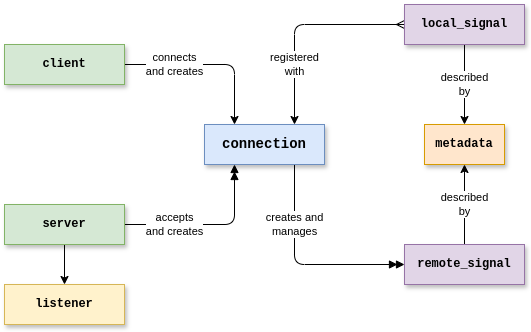

:source-highlighter: highlightjs
:toc: macro
:toclevels: 2

:boost: https://www.boost.org/
:boost-asio: https://www.boost.org/doc/libs/1_83_0/doc/html/boost_asio.html
:clang: https://clang.llvm.org/
:cmake: https://cmake.org/
:cmake-add-subdirectory: https://cmake.org/cmake/help/latest/command/add_subdirectory.html
:cmake-fetch-content: https://cmake.org/cmake/help/latest/module/FetchContent.html
:cmake-find-package: https://cmake.org/cmake/help/latest/command/find_package.html
:cpp17: https://en.wikipedia.org/wiki/C%2B%2B17
:executor: https://www.boost.org/doc/libs/1_83_0/doc/html/boost_asio/overview/model/executors.html
:gcc: https://gcc.gnu.org/
:googletest: https://github.com/google/googletest
:io_context: https://www.boost.org/doc/libs/1_83_0/doc/html/boost_asio/reference/io_context.html
:msvc: https://visualstudio.microsoft.com/vs/features/cplusplus/
:nlohmann-json: https://github.com/nlohmann/json
:signals2: https://www.boost.org/doc/libs/1_83_0/doc/html/signals2.html

== Introduction

This library implements the WebSocket Streaming Protocol in modern C++. The library is built
around link:{boost-asio}[Boost.Asio]. It supports both client and server roles, and in both roles,
data can be published or received using a symmetric API. It is designed for high performance and
reliability. It is platform-independent and can be used on any system supported by Boost.Asio.

toc::[]

=== Dependencies

The library uses a minimal set of dependencies, and will automatically fetch them if they are not
already installed on the host system. As long as CMake and a suitable C++ compiler are installed,
it is usually sufficient to simply clone and build the library without first installing any
additional dependencies.

* Build dependencies:
** Tools:
*** A C++ compiler supporting link:{cpp17}[C{plus}{plus}17] (e.g., link:{gcc}[gcc], link:{clang}[clang], link:{msvc}[MSVC])
*** link:{cmake}[CMake] &ge; 3.24
** Libraries (automatially fetched if necessary):
*** link:{googletest}[GoogleTest] if building unit tests &ge; v1.17.0
*** link:{boost}[Boost] header-only libraries (asio, beast, serialization, signals2) &ge; 1.84
*** link:{nlohmann-json}[nlohmann-json] &ge; v3.12.0
* Runtime dependencies:
** link:{boost}[Boost] compiled libraries (system, url) &ge; 1.84

== Building & Installing the Library

The library can be easily built with CMake:

[source,bash]
cmake -B build
cmake --build build
cmake --install build

NOTE: If Boost was automatically fetched (either because no suitable version was found or because
`WS_STREAMING_IGNORE_INSTALLED_BOOST` was set), then the library cannot be installed, because
Boost's CMake files do not allow installation when loaded as a subproject. A CMake configuration
error will occur if `WS_STREAMING_INSTALL` is `ON`, which is the default when `ws-streaming` is
the top-level CMake project. To solve this, either install a suitable version of Boost first, or
set `WS_STREAMING_INSTALL` to `OFF`.

=== CMake Options

The following CMake options are supported, and their values can be set by adding, for example,
`&#8209;DWS_STREAMING_BUILD_TESTS=OFF` to the first CMake command above:

[options="header,footer"]
|=======================
| Option                                | Description                       | Default
| `WS_STREAMING_BUILD_EXAMPLES`         | Build example programs            | `ON` if top-level project
| `WS_STREAMING_BUILD_TESTS`            | Build unit tests                  | `ON` if top-level project
| `WS_STREAMING_IGNORE_INSTALLED_BOOST` | Always fetch Boost                | `OFF`
| `WS_STREAMING_INSTALL`                | Generate CMake install targets    | `ON`
|=======================

== Using the Library in a Project

The library uses CMake for building and installation. Other CMake projects can easily use
installed versions of the library via link:{cmake-find-package}[find_package()]. Building the
library in-project is also supported, using link:{cmake-fetch-content}[FetchContent] or
link:{cmake-add-subdirectory}[add_subdirectory()].

=== Using an Installed Version of the Library

[source,cmake]
find_package(ws-streaming 3.0.0 REQUIRED)

=== Fetching the Library and Building In-Project

[source,cmake]
----
FetchContent_Declare(ws-streaming
    GIT_REPOSITORY  https://github.com/openDAQ/ws-streaming
    GIT_TAG         v3.0.0
    OVERRIDE_FIND_PACKAGE)

FetchContent_MakeAvailable(ws-streaming)
----

### Linking to the Library

[source,cmake]
target_link_libraries(my-project PUBLIC ws-streaming::ws-streaming)

== Included Examples

=== Basic Examples

These examples demonstrate the basic usage of the library for the most common use-cases.

* link:examples/server-source.cpp[server-source] - Implements a server that publishes
  synchronous scalar data to connected clients.
* link:examples/client-sink.cpp[client-sink] - Implements a client that receives synchronous
  scalar data from a server.

=== Bidirectional Streaming Support

The basic examples above move data in the traditional direction: data is published from a server
to connected clients. The library supports bidirectional streaming, and this direction can be
reversed. These examples demonstrate moving data from a client to a server.

* link:examples/client-source.cpp[client-source] - Implements a client that publishes synchronous
  scalar data to a server.
* link:examples/server-sink.cpp[server-sink] - Implements a server that receives synchronous
  scalar data from connected clients.

=== Other Examples

These examples demonstrate other use-cases, like streaming "asynchronous" signals (those with an
explicit-rule domain signal) and structure-valued signals.

* link:examples/can-source.cpp[can-source] - Implements a server that publishes asynchronous raw
  CAN message structures to connected clients.
* link:examples/can-sink.cpp[can-sink] - Implements a client that receives asynchronous raw CAN
  message structures from a server.
* link:examples/lazy-publish.cpp[lazy-publish] - Demonstrates how to recognize when a remote peer
  is subscribed to a `local_signal` so that data need only be published when it will actually be
  used.

== Detailed Description

=== Terminology & Concepts

* *Client* - An entity that initiates a WebSocket Streaming connection to a *server*. Applications
  use a `client` object to act as a client. The client opens the TCP connection, and submits an
  HTTP Upgrade request to start a WebSocket connection.

* *Event* - A link:{signals2}[Boost.Signals2] object, to which the application can connect
  _slots_, or function objects which are to be called when an event occurs. Events are always
  raised from the context of the Boost.Asio executor given to the library; i.e., slots are called
  from an I/O completion handler dispatched by the executor.

* *Metadata* - A description of a *signal*. Metadata is stored internally and transmitted as a
  JSON object, and specifies the physical format of the data carried by a signal as well as
  information about how an application should interpret that data. Applications publishing data
  can use a `metadata_builder` object to generate a signal description. Applications consuming
  data from a remote peer can inspect a signal's metadata using the `remote_signal::metadata()`
  member function.

* *Peer* - An entity that communicates with another entity using the WebSocket Streaming protocol.
  Applications use a `connection` object, which is typically created by either a `client` or
  `server` object, to act as a peer. Note that after the initial handshake, the wire protocol and
  supported functionality is symmetric. Therefore the documentation usually refers to _peers_
  instead of _clients_ or _servers_ when discussing streaming functionality that applies equally
  regardless of role.

* *Server* - An entity that listens for and accepts WebSocket Streaming connections from
  *clients*. The server listens on one or more TCP ports, and honors HTTP Upgrade requests to
  start WebSocket connections. Servers also accept JSON-RPC *command interface* requests to
  support stream management (subscribe/unsubscribe) by older clients that do not support the
  in-band command interface.

* *Signal* - An entity which carries data that can be transmitted from one peer to another, and
  which is described by *metadata*. Signals can be _published_ by a peer, using a `local_signal`
  object, such that data generated by the application is streamed to and received by the remote
  peer. Signals can also be _received_, such that data generated by the remote peer is made
  available to the application via `remote_signal` objects managed by a `connection` object.

* *Sink* - A *peer* which receives data from the remote peer. To act as a sink, an application
  reacts to a `connection` or `server` object's `on_available` event, which supplies the
  application with a `remote_signal` object that can be used to inspect, subscribe to, and
  receive data from the signal.

* *Source* - A *peer* which sends data to the remote peer. To act as a source, an application
  creates a `local_signal` object and registers it with a `connection`, or with a `server` (which
  then registers the object with all the connections it manages).

=== Setup: Boost.Asio Integration

The streaming library is based on link:{url}[Boost.Asio] and requires an link:{executor}[executor]
to perform asynchronous I/O operations. The application must supply and manage the executor.
In most cases, this is as simple as instantiating an link:{io_context}[io_context] and calling its
`run()` function in a thread:

[source,cpp]
----
boost::asio::io_context ioc{1};
std::thread thread{[&] { ioc.run(); }};
----

The application may also use the executor for its own purposes, or use any other object that
implements the `executor` concept.

=== Client Role: Connecting to a Server

The application can act as a client using a `client` object. This object asynchronously connects
to a server by opening a TCP connection and submitting an HTTP Upgrade request to start a
WebSocket connection. It also performs a WebSocket Streaming Protocol handshake and prepares the
connection for the exchange of data. When the connection process is complete, the specified
completion handler is invoked, either with an error code or with a shared pointer to a
`connection` object.

[source,cpp]
----
wss::client client{ioc.get_executor()};

client.async_connect(
    "ws://localhost:7414",
    
    {
        if (ec)
        {
            std::cerr << "connection failed: " << ec << std::endl;
            return;
        }

        std::cout << "connected to server" << std::endl;

        // application can now use the given connection_ptr to manage the connection;
        // when the last copy of the connection_ptr is destroyed, the connection is closed
    });
----

=== Server Role: Accepting Connections from Clients

The application can act as a server using a `server` object. This object asynchronously listens
for TCP connections on one or more ports, and waits for HTTP Upgrade requests to start a WebSocket
connection. It also performs WebSocket Streaming Protocol handshakes and prepares connections for
the exchange of data. When a new connection has been established, the `on_client_connected` event
is raised, with a shared pointer to a `connection` object.

Server objects also act as aggregators. For sinked data (received from a remote peer), the
`on_available` and `on_unavailable` events are raised when the corresponding events for any
connected client are raised. Likewise, for sourced data (sent to a remote peer), any
`local_signal` registered with the server is also registered with all the connections managed by
that server.

[source,cpp]
----
wss::server server{ioc.get_executor()};
server.add_default_listeners();
server.run();

server.on_client_connected.connect(
    
    {
        // application can now use the given connection_ptr to manage the connection;
        // unlike in the client role, the server object internally holds a copy of the
        // connection_ptr, so the connection stays open until the server is closed
    });
----

=== Source Role: Sending Data to Remote Peers

The application can act as a data source by creating one or more `local_signal` objects and
registering them with a `connection` or with a `server`. The application must create `metadata`
describing the signal data, and then use the `publish_data()` member function to notify the
library that new data is available to be streamed.

[source,cpp]
----
wss::local_signal signal{
    "/Value",
    wss::metadata_builder{"Value"}
        .data_type(wss::data_types::real64_t)
        .build()};

connection_or_server.add_local_signal(signal);

// In an acquisition loop
signal.publish_data(
    timestamp,
    sample_count,
    ptr_to_samples,
    byte_count);
----

=== Sink Role: Receiving Data from Remote Peers

The application can act as a data sink by subscribing to one or more `remote_signal` objects
provided by a `connection` or `server`.

[source,cpp]
----
connection->on_available.connect(
    
    {
        if (signal->id() == "/Value")
        {
            signal->subscribe();
            signal->on_data_received.connect(
                
                {
                    std::cout << "received " << sample_count << " sample(s)" << std::endl;
                });
        }
    });
----
